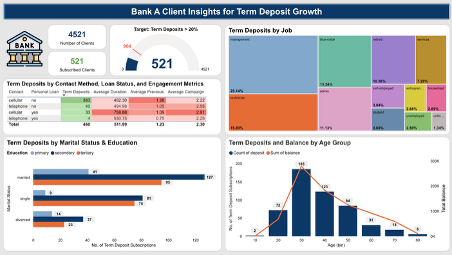
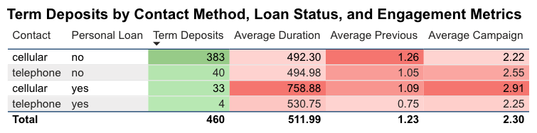
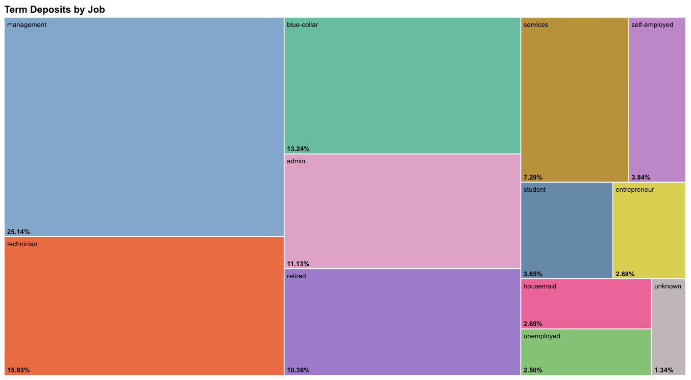
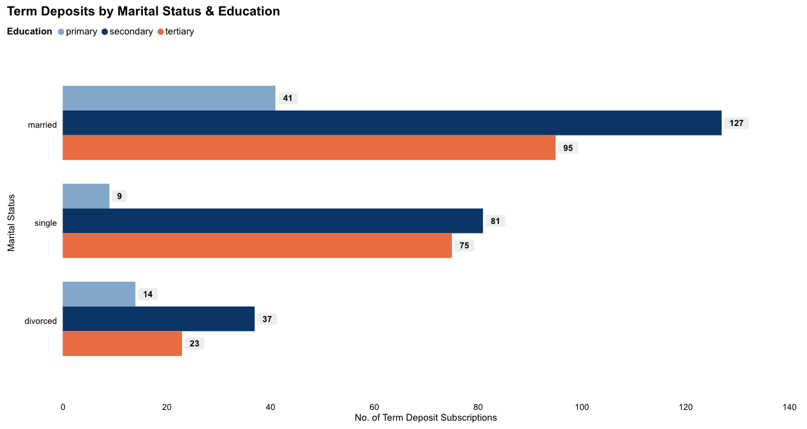
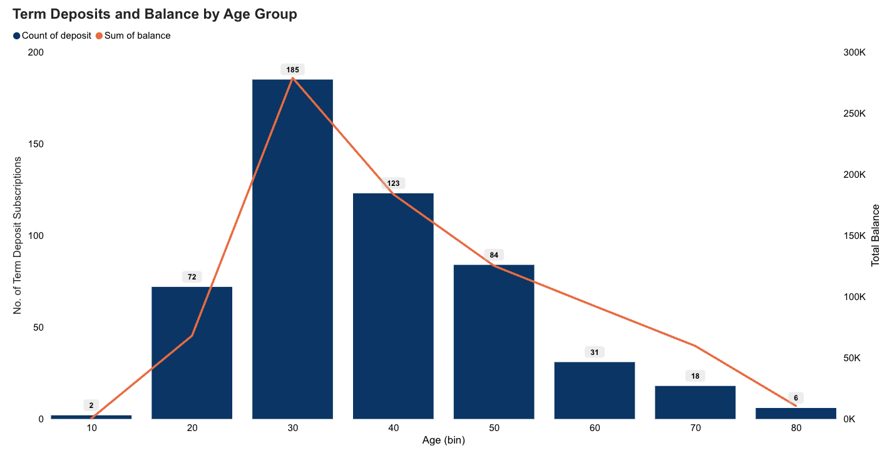

# 🏦 Bank Marketing Analytics: Customer Segmentation & Subscription Prediction

This study analyses **4,521 bank client records** to identify high-converting customer segments and improve term deposit subscription rates. It demonstrates end-to-end analytics using descriptive statistics, data visualisation, and business-focused storytelling with **Power BI**.

---

## 🏷️ Business Context

Bank A ran a phone-based marketing campaign to encourage clients to subscribe to term deposits. The challenge is to identify **which client profiles are most likely to convert** so future campaigns can be targeted more effectively, reducing wasted outreach and improving subscription rates.

---

## 🗂️ Dataset

This study uses a bank marketing dataset containing **4,521 records across 14 variables**, including demographic data (age, job, marital status, education), financial indicators (balance, housing loan, personal loan), and campaign engagement metrics (contact type, call duration, number of contacts).

- **Records**: 4,521 clients
- **Variables**: 14 (5 ratio, 1 ordinal, 8 nominal)
- **Target Variable**: `deposit` (whether the client subscribed to a term deposit)

---

## 📋 Executive Summary

- **Top Segment**: Loan-free clients contacted via cellular had the highest subscription count (383 deposits) and the shortest average call duration, suggesting concise mobile outreach is most effective
- **Job Distribution**: Management, technician, and blue-collar roles accounted for over 50% of total deposits
- **Demographics**: Married clients with secondary education were the top-converting segment across all marital groups
- **Campaign Insight**: Clients with moderate prior engagement but fewer current campaign contacts converted better; quality over quantity

> **Business Takeaway**: Target loan-free, cellular-reachable clients with brief, focused pitches. Prioritise management and technician roles, and avoid over-contacting clients within a single campaign.

---

## ⚙️ Tools Used

- **Analysis**: Microsoft Excel (descriptive statistics, summary measures)
- **Visualisation**: Power BI (heat map, tree map, bar charts, bar-line chart)

---

## 🗃️ Project Structure

- `data/` — Dataset and data dictionary
- `powerbi/` — Power BI dashboard file (.pbix)
- `visuals/` — Screenshots of individual charts and full dashboard

---

## 📈 Dashboard

### Full Dashboard

---

### Heat Map: Subscription Rate by Contact Type & Loan Status

> Loan-free clients contacted via cellular show the highest subscription count (383) and shortest average call duration (492s). Brief, mobile-focused outreach drives the best conversion.

### Tree Map: Deposit Distribution by Job Type

> Management, technician, and blue-collar roles collectively account for over 50% of subscriptions. These segments represent the highest-priority targeting groups.

### Side-by-Side Bar Chart: Deposits by Marital Status & Education

> Married clients lead in overall deposit counts. Secondary-educated clients contribute the most deposits across all marital statuses.

### Bar-Line Chart: Deposits and Balance by Age Group

> Visualises the relationship between account balance and subscription likelihood across age groups, highlighting which age bands represent the most financially engaged clients.

---

## 🔍 Analytics Approach

**Descriptive Analysis**
- Classified all 14 variables by data type (nominal, ordinal, interval, ratio)
- Computed summary measures: mean, median, mode, standard deviation, min/max for ratio variables; mode and frequency counts for categorical variables

**Proposed Analytics Solution**
- **Clustering**: Segment clients into distinct behavioural groups using variables like balance, age, and contact frequency to enable personalised outreach
- **Predictive Modelling**: Build a classification model (e.g. logistic regression or decision tree) on historical campaign data to predict subscription likelihood for new clients, enabling proactive targeting before campaigns launch

---

## 🎯 Key Results

| Segment | Subscription Count | Avg Call Duration |
|---|---|---|
| Cellular, no personal loan | 383 | 492.30s |
| Management (job) | Highest among job types | N/A |
| Married, secondary education | Highest across marital groups | N/A |

---

## 🚫 Limitations

- Dataset reflects a single historical campaign; client behaviour may shift across economic conditions
- `poutcome` (previous campaign outcome) is unknown for 82% of records, limiting prior engagement analysis
- No real-time or longitudinal data available; findings are descriptive and inferential only
